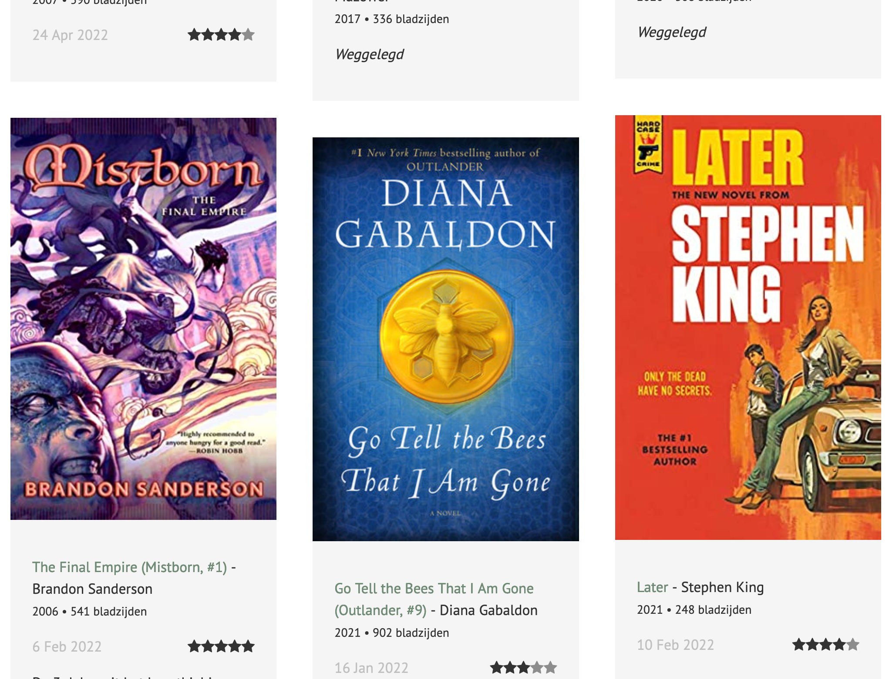

# Kirby Plugin: MyGoodreads

This plugin allows you to show recent posts for a Goodreads account on your Kirby site

## Git submodule

```
git submodule add https://github.com/mirthe/kirby_mygoodreads site/plugins/mygoodreads
```

## Usage

Add your Goodreads API key and account number to your config

    'goodreads.apiKey'  => 'xxx',
    'goodreads.accountnr'  => 'xxx'

Include the snippet to display your books on a page

    <?php snippet('goodreads-books-read'); ?>

## Example 

https://mirthe.org/boeken



## Todo

- Offer as an official Kirby plugin
- Add translations for labels
- Add sample SCSS to this readme
- Cleanup code
- Lots..
